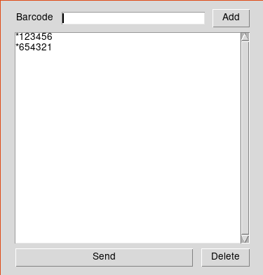

# Barcodely

<p align="center">
  
</p>

Send barcode events to Odoo.

This allows us to test barcode functionality without the need of an barcode scanner. 

There are other options out there, albeit, they are: Heavy, require a mobile app, subscription based, etc. 

## How does it work?

Exporting keyboard events using pyautogui and focusing Odoo window using xdotool.

### What Works

* Send barcode events
* Save barcodes to listbox

### What's missing

* ~~Persistent barcodes in listbox~~
* User configuration (eg. Window title names, etc)
* Systray
* Executable

### Installation

Install xdotool

```bash
sudo apt update && sudo apt install xdotool
```

Install python3 requirements

``` bash
pip3 install -r requirements.txt
```
